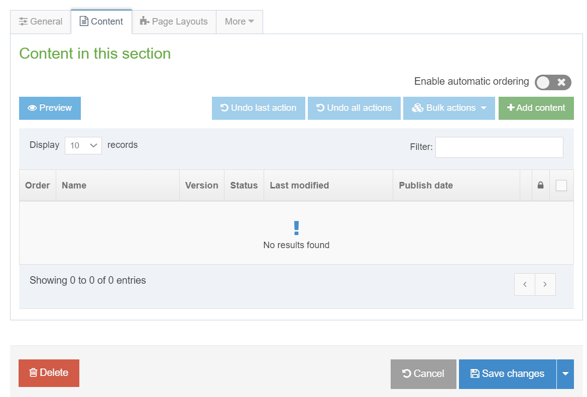

# Workarounds for TerminalFour to Improve Usability
Our web development team wasn't able to create the TerminalFour templates we requested, so I created some hacky workarounds.

## Motivation Behind the Project 
As of October, 2024, our permissions on TerminalFour don't allow us to upload separate JavaScript modules or CSS stylesheets.

However, we _are_ allowed to write general HTML.

Because of this, we can include styling between <style> tags, and we can include the JavaScript between <script> tags.

---
## Tutorial
Here are the steps required to add this content to TerminalFour, given our current selections of templates.

For the purposes of instruction, I've created a new section on our T4 webpage. Upon creation, the editor will show something like this:

From here, we begin our nested accordion journey.

---

### Adding Custom Styling 
Under construction.

---

### Adding the Outer Accordion
Under construction. 

---

### Adding Content Inside the Outer Accordion
Under construction.

---

### Adding an Accordion Inside an Accordion
Under construction.

---

### Adding Code to Support Accordion "Autoclick" Upon Opening the Webpage
Under construction.

---

### Sending Links that Contain the "Autoclick"
Under construction.

